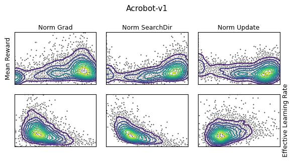

# Empirical Analysis of the TRPO Update Step
<p align="center">
Willemijn de Hoop, Siem Teusink, Casper Wortmann, Ivo Verhoeven
<br><br>

</p>
===================

### General info ###
This folder contains all the necessary files for our 'Reproducible Research Assignment' for the University of Amsterdam's 2021 rendition of Reinforcement Learning. Our findings can be found in our [report](./RL_Reproducible_Research_Assignment.pdf).


===================
### Folders included ###
- continuous_trpo            : contains all files related to continuous TRPO training.
- discrete_trpo              : contains all files related to discrete TRPO training.
- figures                    : TRPO training figures.


### Generating results ###

### 1. Setting up conda environment.
Create conda environment from .yml:
```
conda env create -f environment.yml
```

Start the environment
```
conda activate rlcourse
```

## 2. Generating discrete results
### 2a. Running the discrete TRPO files.
Discrete training should work out-of-the-box.

Run the experiment
```
python train_trpo.py --config_file_path [config_file] --seed [seed]
```

Hyperparameters are defined by a config.yaml file, see [here](./discrete_trpo/configs/).
<tt>config_file</tt> should be a path to a legal config file. Defaults to './discrete_trpo/configs/CartPole_v1.yaml'


Can specify 0 (none), 1 (int) or multiple (list of ints) seeds for experimentation. Will overwrite default seed in config file. Defaults to <tt>[0,1,2,3,4,5,6,7,8,9]</tt>. Will run script for every seed, and dump in same checkpoint dir.


### 2b. Generating figures
Download experiment output from [here](https://drive.google.com/drive/folders/11W_kSgnhGsb-wYE91O05mjjQhgdUO_rM?usp=sharing).

Run the figure script (discrete)
```
python discrete_plots.py --tasks [task_names] --paths [experiment_output_files]
```
The tasks for which we can plot are defined by a list of strings, <tt>task_names</tt>.

<tt>experiment_output_files</tt> should be a list of paths to the tensorboard output of the experiments.


### 3. Running the continuous TRPO files.

#### 3a. Prerequirement: install Mujoco
```
# Installing Mujoco can be quite a hassle.  For installation we refer to:
https://github.com/reinforcement-learning-kr/pg_travel/wiki/Installing-Mujoco-py-on-Linux

```
#### 3b. Running the files.
Navigate to the continuous_trpo folder
```
cd continuous_trpo/mujoco
```

Run the experiment
```
python main.py --env [environment]
```
The results are stored in the folder: [logs_json]/

<tt>environment</tt> can be any of [Swimmer-v2, Walker2d-v2, Hopper-v2].


### 3c. Generating figures
Run the figure script (continuous)
```
python continuous_plots.py 
```